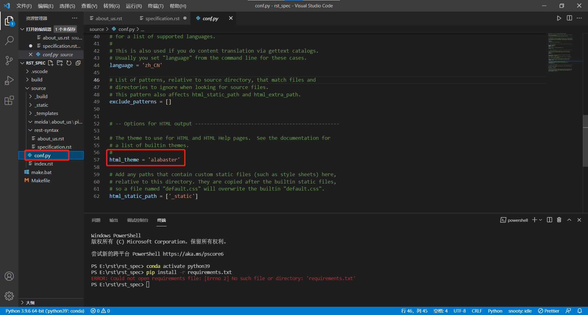

新建文档相关配置
~~~~~~~~~~~~~~~~~~~

初始化
--------

.. code-block:: sh
   :linenos:

    pip install Sphinx
    pip install sphinxcontrib-fulltoc
    sphinx-quickstart

cmd输入上述指令进行新建文档，过程中会有一些提示，需要填写项目名称，和选择一些基础的设置等等，选择yes or no 的时候选择yes。

.. code-block:: sh
   :linenos:

    > Project name: myProject
    > Author name(s): xxx
    > Project release []: 0.1.0
    > Project language [en]: zh_CN

其他配置上述所示。

后续版本号release设置规则：
---------------------------

1. 项目初版本时，版本号可以为 0.1 或 0.1.0, 也可以为 1.0 或 1.0.0，如果你为人很低调，我想你会选择那个主版本号为 0 的方式；

#. 当项目在进行了局部修改或 bug 修正时，主版本号和子版本号都不变，修正版本号加 1；

#. 当项目在原有的基础上增加了部分功能时，主版本号不变，子版本号加 1，修正版本号复位为 0，因而可以被忽略掉；

#. 当项目在进行了重大修改或局部修正累积较多，而导致项目整体发生全局变化时，主版本号加 1；

#. 另外，编译版本号一般是编译器在编译过程中自动生成的，我们只定义其格式，并不进行人为控制。

主题更换
-----------

  
  图 1 主题更改

统一使用"sphinx_rtd_theme"主题。